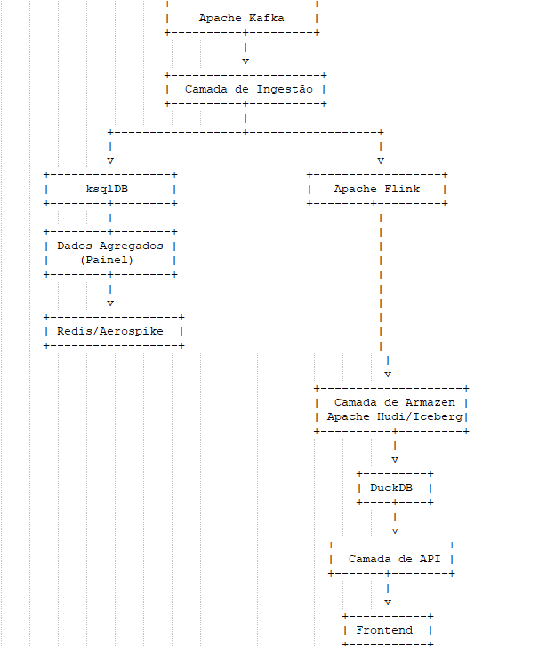

# **Plataforma de Comunicação para Notificações WhatsApp**

---

## **Índice**

- [Visão Geral](#visão-geral)
- [Objetivos](#objetivos)
- [Arquitetura Proposta](#arquitetura-proposta)
  - [Descrição do Diagrama](#descrição-do-diagrama)
  - [1. Camada de Ingestão de Dados](#1-camada-de-ingestão-de-dados)
  - [2. Camada de Processamento de Dados](#2-camada-de-processamento-de-dados)
  - [3. Camada de Armazenamento de Dados](#3-camada-de-armazenamento-de-dados)
  - [4. Camada de API](#4-camada-de-api)
  - [5. Camada de Frontend](#5-camada-de-frontend)
  - [6. Agendamento e Orquestração de Tarefas](#6-agendamento-e-orquestração-de-tarefas)
  - [7. Monitoramento e Observabilidade](#7-monitoramento-e-observabilidade)
- [Fluxo de Dados Detalhado](#fluxo-de-dados-detalhado)
- [Inovações e Tecnologias de Ponta](#inovações-e-tecnologias-de-ponta)
  - [Integração do DuckDB](#integração-do-duckdb)
  - [Arquitetura Data Lakehouse com Apache Iceberg](#arquitetura-data-lakehouse-com-apache-iceberg)
  - [Arquitetura Orientada a Eventos](#arquitetura-orientada-a-eventos)
  - [Implementação de Machine Learning](#implementação-de-machine-learning)
  - [Micro-Frontends](#micro-frontends)
  - [Segurança e Conformidade Avançadas](#segurança-e-conformidade-avançadas)
- [Considerações sobre Complexidade, Custo e Escalabilidade](#considerações-sobre-complexidade-custo-e-escalabilidade)
  - [Complexidade](#complexidade)
  - [Custo](#custo)
  - [Escalabilidade](#escalabilidade)
- [Avaliação de Alternativas](#avaliação-de-alternativas)
- [Próximos Passos](#próximos-passos)
- [Conclusão](#conclusão)
- [Como Utilizar este README](#como-utilizar-este-readme)
- [Contato](#contato)

---

## **Visão Geral**

Este documento propõe uma solução arquitetônica inovadora para uma plataforma de comunicação que computa e apresenta notificações do WhatsApp de milhares de clientes a cada minuto. A plataforma atende aos seguintes requisitos:

- **Painel de Notificações**: Interface gráfica simples que exibe a contagem de notificações por cliente, atualizada a cada minuto.
- **Relatório Detalhado de Notificações**: Relatório exportável com dados detalhados das notificações.
- **Relatório de Cobrança**: Relatório de cobrança diário por cliente.

---

## **Objetivos**

- **Alto Desempenho**: Lidar com um volume de 100 milhões de mensagens por dia.
- **Baixa Latência**: Atualizações em tempo real para o painel de notificações.
- **Escalabilidade**: Suporte a crescimento futuro em termos de volume de dados e funcionalidades.
- **Custo-Efetividade**: Utilizar tecnologias que oferecem o melhor retorno sobre investimento.
- **Inovação**: Incorporar tecnologias e práticas modernas para oferecer uma solução de ponta.

---

## **Arquitetura Proposta**

### **Descrição do Diagrama**

O diagrama acima ilustra a arquitetura proposta para a plataforma de comunicação de notificações WhatsApp. Os principais componentes e fluxos de dados são:

1. **Apache Kafka**: Fonte de dados que recebe 100 milhões de mensagens por dia.

2. **Camada de Ingestão de Dados**:
   - **Kafka Connect**: Integração e ingestão de dados em sistemas downstream.
   - **ksqlDB**: Realiza processamento de streams em tempo real para agregações simples, alimentando o Redis/Aerospike para o painel de notificações.

3. **Camada de Processamento de Dados**:
   - **Apache Flink**: Lida com processamento de streams complexo e estado, preparando dados detalhados para armazenamento.

4. **Camada de Armazenamento de Dados**:
   - **Redis/Aerospike**: Armazena dados agregados para acesso rápido pelo painel de notificações.
   - **Apache Hudi/Iceberg** no **Data Lake**: Armazena dados detalhados em formato Parquet.

5. **DuckDB**:
   - Acessa diretamente os arquivos Parquet no Data Lake para consultas analíticas e geração de relatórios detalhados e de cobrança.

6. **Camada de API**:
   - **APIs GraphQL Serverless**: Fornecem dados para o frontend.
   - **Microsserviços**: Gerenciam a lógica de negócios.

7. **Camada de Frontend**:
   - **React.js** com **Next.js**: Exibe o painel de notificações com atualizações em tempo real usando **WebSockets** ou **SSE**.
   - **PWA (Progressive Web App)**: Permite funcionalidades offline e notificações push.

8. **Agendamento e Orquestração de Tarefas**:
   - **Apache Airflow**: Orquestra tarefas como a geração diária de relatórios de cobrança.
   - **Eventos Orientados** (ex: **AWS EventBridge**): Acionam tarefas com base em eventos específicos.

9. **Monitoramento e Observabilidade**:
   - **Prometheus/Grafana**: Monitoram métricas e a saúde do sistema.
   - **ELK/EFK Stack**: Coleta e analisa logs centralizados.
   - **Ferramentas de AIOps** (ex: **Datadog**, **New Relic**): Detectam anomalias.

---

### **1. Camada de Ingestão de Dados**

**Tecnologias**:

- **Apache Kafka**: Plataforma de streaming distribuída usada como fonte de dados.
- **Kafka Connect**: Para integração e ingestão de dados em outros sistemas.
- **Apache Pulsar** *(opcional)*: Considerado para recursos avançados como multi-tenancy.

**Detalhes**:

- Consumidores Kafka dedicados para ler dados em tempo real.
- Uso de **Kafka Streams** e **ksqlDB** para processamento imediato de dados simples.

### **2. Camada de Processamento de Dados**

**Tecnologias**:

- **Apache Flink**: Para processamento de streams com baixa latência e estado.
- **ksqlDB**: Para consultas SQL em streams Kafka em tempo real.
- **DuckDB**: Banco de dados analítico embutido para processamento local eficiente.

**Inovação com DuckDB**:

- **Integração do DuckDB**: Utilizado para consultas analíticas rápidas em dados Parquet armazenados no Data Lake.
- **Processamento Local**: DuckDB permite executar análises complexas localmente sem a sobrecarga de um data warehouse tradicional.
- **Uso em Relatórios Detalhados**: Geração de relatórios detalhados diretamente dos arquivos Parquet usando DuckDB.

### **3. Camada de Armazenamento de Dados**

**a. Dados em Tempo Real (Painel de Notificações)**

- **Tecnologia**: **Redis** ou **Aerospike**.
- **Justificativa**: Armazenamento em memória para acesso ultra-rápido aos dados agregados.

**b. Dados Detalhados de Notificações**

- **Tecnologia**: **Apache Hudi** no Data Lake, com arquivos em formato **Parquet**.
- **Justificativa**: Gerenciamento eficiente de grandes volumes de dados históricos com capacidade de processamento incremental.

**c. Dados de Cobrança e Análises**

- **Tecnologia**: **Data Lakehouse** com **Apache Iceberg** e integração com **DuckDB**.
- **Justificativa**: Combina as vantagens de Data Lakes e Data Warehouses, permitindo transações ACID e processamento unificado.

### **4. Camada de API**

**Tecnologias**:

- **GraphQL**: Para APIs flexíveis e eficientes.
- **Microsserviços Serverless**: Usando **AWS Lambda**, **Google Cloud Functions** ou **Azure Functions**.
- **gRPC**: Para comunicação de alta performance entre serviços.

**Detalhes**:

- **APIs GraphQL** permitem que clientes solicitem exatamente os dados necessários.
- **Serverless** reduz custos e escala automaticamente.

### **5. Camada de Frontend**

**Tecnologias**:

- **React.js** com **Next.js** para renderização otimizada.
- **WebSockets** ou **Server-Sent Events (SSE)** para atualizações em tempo real.
- **Progressive Web App (PWA)**: Para experiência semelhante a aplicativos nativos.

**Inovação**:

- **Micro-Frontends**: Arquitetura que permite desenvolvimento e implantação independentes de diferentes partes do frontend.

### **6. Agendamento e Orquestração de Tarefas**

**Tecnologias**:

- **Apache Airflow**: Para orquestração de fluxos de trabalho.
- **Eventos Orientados**: Usando **AWS EventBridge** ou equivalentes.

**Detalhes**:

- **Airflow** para tarefas complexas de ETL e geração de relatórios.
- **Triggers Baseados em Eventos** garantem que tarefas sejam executadas no momento certo.

### **7. Monitoramento e Observabilidade**

**Tecnologias**:

- **Prometheus** e **Grafana**: Para métricas e dashboards.
- **ELK Stack (Elasticsearch, Logstash, Kibana)** ou **EFK Stack** com **Fluentd**.
- **Ferramentas de AIOps**: Como **Datadog** ou **New Relic** para detecção de anomalias.

**Detalhes**:

- **Monitoramento Proativo**: Alertas configurados para métricas-chave.
- **Logging Centralizado**: Facilitando a depuração e análise de incidentes.

---

## **Fluxo de Dados Detalhado**

1. **Ingestão**:

   - Mensagens do **Apache Kafka** são consumidas em tempo real.
   - **ksqlDB** realiza agregações simples para o painel de notificações.

2. **Processamento**:

   - **Apache Flink** lida com lógica complexa e estado.
   - Dados são enriquecidos e preparados para armazenamento.

3. **Armazenamento**:

   - **Redis/Aerospike** armazenam dados agregados para acesso rápido.
   - Dados detalhados são armazenados em **Apache Hudi** no Data Lake em formato Parquet.
   - **DuckDB** acessa diretamente os arquivos Parquet para consultas rápidas.

4. **API Backend**:

   - **GraphQL Serverless** fornece dados para o frontend.
   - **Microsserviços** gerenciam lógica de negócios.

5. **Frontend**:

   - Aplicação **React.js** exibe o painel com atualizações em tempo real.
   - **PWA** permite funcionalidades offline e notificações push.

6. **Agendamento de Tarefas**:

   - **Apache Airflow** orquestra a geração de relatórios de cobrança.
   - Tarefas são acionadas por eventos específicos.

7. **Monitoramento**:

   - **Prometheus/Grafana** monitoram a saúde do sistema.
   - **ELK/EFK Stack** gerencia logs centralizados.
   - **AIOps** detectam e alertam sobre anomalias.

---

## **Inovações e Tecnologias de Ponta**

### **Integração do DuckDB**

- **Processamento Analítico Local**: DuckDB permite executar consultas analíticas diretamente nos arquivos Parquet do Data Lake, reduzindo a necessidade de infraestrutura adicional.
- **Desempenho**: Projetado para processamento analítico rápido, aproveitando recursos modernos de hardware.

### **Arquitetura Data Lakehouse com Apache Iceberg**

- **Transações ACID**: Garante consistência dos dados mesmo em operações concorrentes.
- **Evolução de Esquema**: Facilita a alteração e gerenciamento do esquema dos dados ao longo do tempo.
- **Time Travel**: Capacidade de consultar versões anteriores dos dados para auditoria e depuração.

### **Arquitetura Orientada a Eventos**

- **Reatividade**: O sistema responde a eventos em tempo real, melhorando a eficiência.
- **Desacoplamento**: Serviços independentes comunicam-se através de eventos, aumentando a modularidade.

### **Implementação de Machine Learning**

- **Análise Preditiva**: Previsão de padrões de uso e engajamento.
- **Detecção de Anomalias**: Identificação proativa de problemas ou comportamentos inesperados.

### **Micro-Frontends**

- **Escalabilidade de Desenvolvimento**: Equipes podem trabalhar de forma independente em diferentes partes do frontend.
- **Flexibilidade Tecnológica**: Possibilidade de utilizar diferentes tecnologias ou frameworks conforme necessário.

### **Segurança e Conformidade Avançadas**

- **Criptografia Avançada**: Uso de algoritmos modernos e gerenciamento de chaves seguro.
- **Conformidade com GDPR e LGPD**: Processos automatizados para gerenciamento de consentimento e direitos dos titulares de dados.
- **Auditoria e Rastreamento**: Logs detalhados para rastreabilidade e auditoria completa do sistema.

---

## **Considerações sobre Complexidade, Custo e Escalabilidade**

### **Complexidade**

- **Gestão de Múltiplas Tecnologias**: A integração de várias ferramentas exige expertise diversa.
- **Automação**: Investimento inicial em automação reduz complexidade operacional a longo prazo.

### **Custo**

- **Serviços em Nuvem**: Uso estratégico de serviços serverless e gerenciados para otimizar custos.
- **Open Source**: Adoção de tecnologias open-source como DuckDB, Apache Flink e Iceberg reduz custos de licenciamento.

### **Escalabilidade**

- **Escalonamento Horizontal**: Componentes projetados para escalar horizontalmente.
- **Autoescalonamento**: Configuração de políticas de autoescalonamento baseadas em métricas reais.

---

## **Avaliação de Alternativas**

- **Bancos de Dados Tradicionais**: Não escalam adequadamente para o volume de dados esperado.
- **Processamento Batch**: Introduz latência indesejada para o painel em tempo real.
- **Arquiteturas Monolíticas**: Menos flexíveis e escaláveis em comparação com microsserviços.

---

## **Próximos Passos**

1. **Prototipação Rápida**: Desenvolver um MVP para validar as escolhas tecnológicas.
2. **Análise Detalhada de Custos**: Estimar custos operacionais e identificar oportunidades de otimização.
3. **Planejamento de Capacitação**: Garantir que a equipe tenha as habilidades necessárias ou providenciar treinamentos.
4. **Teste de Carga e Performance**: Validar a escalabilidade e resiliência do sistema sob condições reais.

---

## **Conclusão**

A proposta apresentada oferece uma solução robusta, escalável e inovadora para a plataforma de comunicação de notificações WhatsApp. Ao integrar tecnologias modernas como DuckDB, Apache Iceberg e uma arquitetura orientada a eventos, a plataforma está posicionada não apenas para atender às necessidades atuais, mas também para evoluir e escalar conforme as demandas futuras.

Esta arquitetura demonstra uma visão estratégica e uma abordagem centrada em inovação, alinhando-se com as melhores práticas de engenharia de software e plataformas de dados atuais. Com este design, a organização estará preparada para oferecer um serviço de alta qualidade, eficiente e pronto para o futuro.

---

